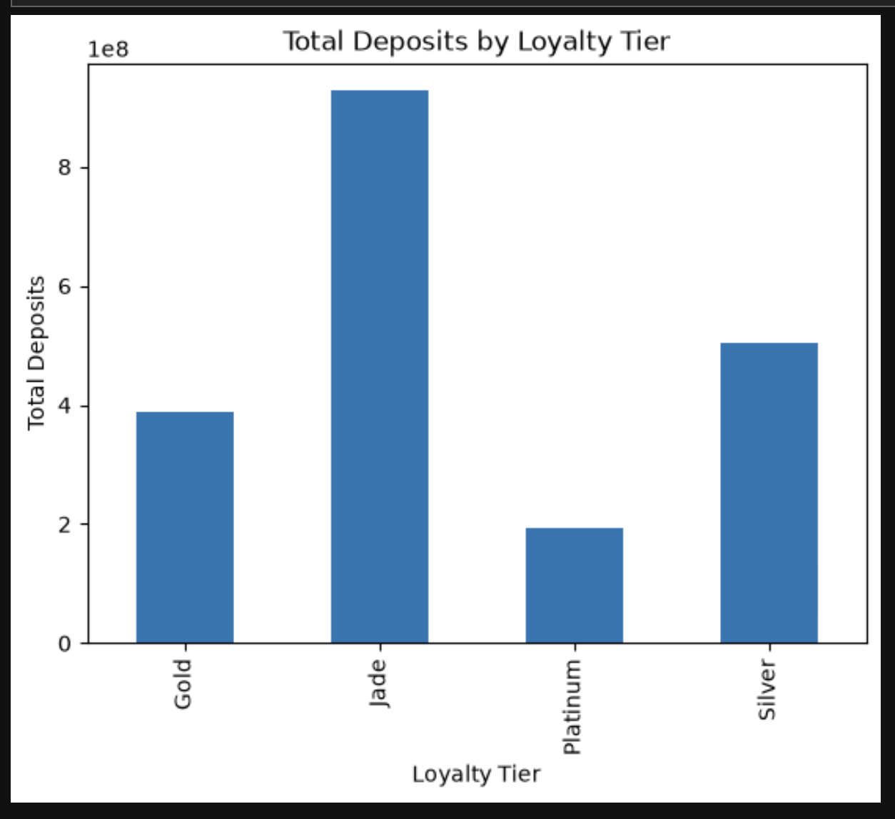
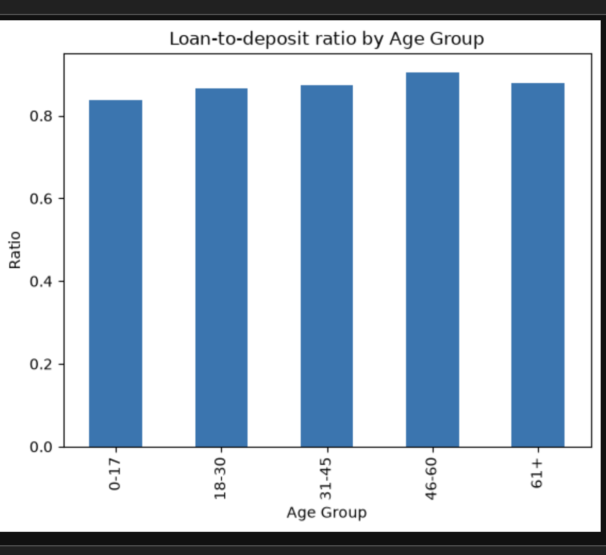
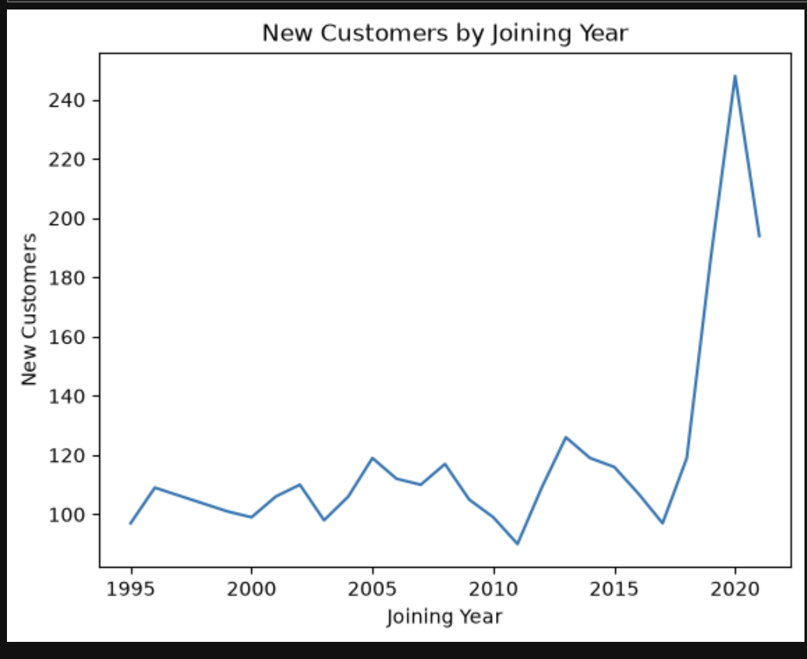
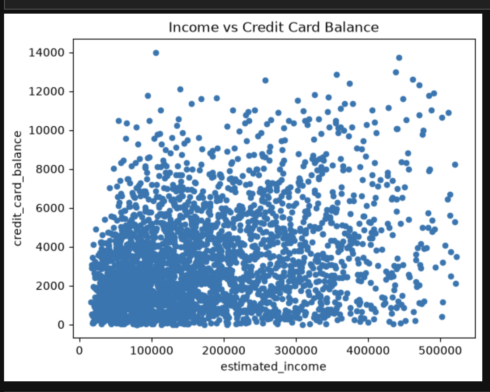

# Banking Customer Analysis

## 📌 Project Overview

This project analyzes customer banking data to understand customer segments, deposits, loans, growth trends, fee structures, and the relationship between income and credit card balances.

The analysis was performed using **Python (Pandas)** for data cleaning and preprocessing, and **PostgreSQL** for business-focused SQL analysis. Python was also used to create visualizations.

## 🛠️ Tools & Technologies

- Python
- Pandas
- NumPy
- Matplotlib
- PostgreSQL
- SQL
- Jupyter Notebook

## 📊 Dataset

The dataset (`Banking.csv`) contains **3,000 banking customer records** with information including:

- Customer details
- Age and nationality
- Occupation
- Income
- Bank deposits
- Bank loans
- Checking and savings accounts
- Credit card balance
- Fee structure
- Loyalty classification
- Bank joining date

The data does not specify a currency, so values are shown as plain numbers.

## 🧹 Data Cleaning & Preparation

The following steps were performed using Python:

- Standardized column names
- Checked missing values (none found)
- Checked duplicate records (no fully duplicate rows)
- Investigated duplicate `client_id` values: 60 IDs were repeated, but each belonged to a different customer (different name, age and occupation). These were treated as ID collisions, not duplicates, so **all rows were kept**
- Created a unique row-level `id` to use as the primary key
- Converted `joined_bank` into datetime format
- Created age groups (0-17, 18-30, 31-45, 46-60, 61+). 39 customers are aged 17 and were kept in the 0-17 group
- Extracted joining year
- Created loan-to-deposit ratio (left empty for the 34 customers with zero deposits)
- Exported the cleaned dataset as `banking_cleaned.csv`

## 🔎 Business Questions

The analysis answers the following questions:

1. Which loyalty tier has the highest deposits and loans?
2. How do income, deposits, and loans change across age groups?
3. Which customer segment has the highest loan-to-deposit ratio?
4. Is there any relationship between fee structure and loyalty tier or account balances?
5. Which occupations and nationalities are the most valuable to the bank?
6. How has customer growth changed by joining year?
7. What is the relationship between credit card balance and income?

## 📈 Key Insights

### 1. Loyalty Tier
**Jade** has the highest total deposits at **927.14M** and the highest total loans at **806.15M**.

### 2. Age Groups
Income, deposits, and loans increase with age. The **61+ age group** has the highest totals across all three measures.

### 3. Loan-to-Deposit Ratio
The **46–60 age group** has the highest loan-to-deposit ratio at **0.90**. This means its total loans are around 90% of its total deposits.

### 4. Fee Structure
There is **no strong relationship** between fee structure and loyalty tier. Account balances are also relatively similar across High, Mid, and Low fee structures.

### 5. Occupations & Nationalities
**Structural Analysis Engineer** has the highest total deposits among occupations at **22.84M**.

Among nationalities, **European customers** have the highest total deposits at **873.97M**.

> For this analysis, customer value is measured using total deposits.

### 6. Customer Growth
Customer growth remained relatively steady from **1995 to 2018**, increased sharply in **2019**, and peaked in **2020 with 248 new customers**.

### 7. Income & Credit Card Balance
Income and credit card balance show a **weak-to-moderate positive relationship**, with a correlation of **0.299**.

## 📊 Visualizations

The project includes Python visualizations for:

- Total Deposits by Loyalty Tier
  

- Loan-to-Deposit Ratio by Age Group

  
- New Customers by Joining Year

  
- Income vs Credit Card Balance

  

## 📁 Project Files

```text
Banking-Customer-Analysis/
│
├── Banking.csv
├── banking_analysis.ipynb
├── banking_analysis.sql
├── banking_cleaned.csv
└── README.md
```
